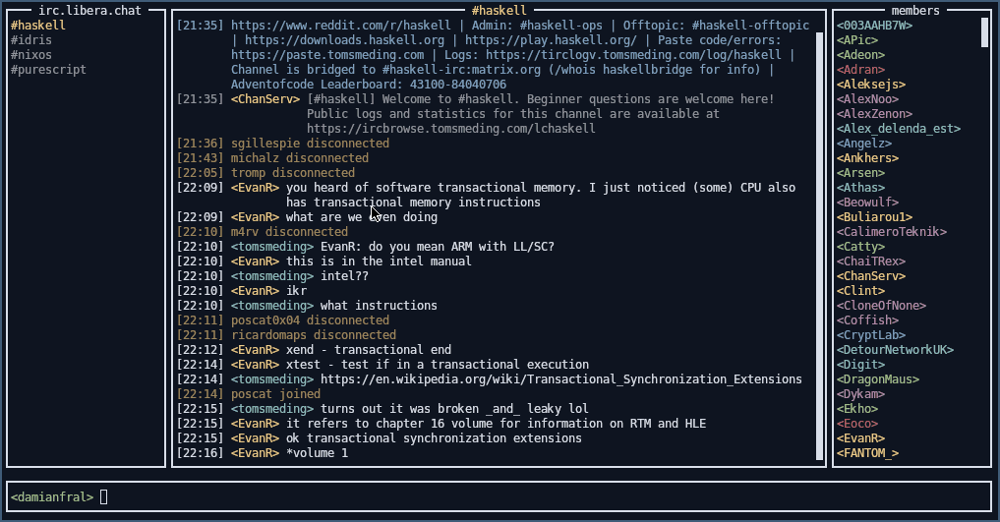

# hirc



A ground-up Haskell IRC client built for educational purposes.

- **Relude** as a custom prelude

- **Plain IO + STM concurrency** for the core IRC layer (no monad
  transformers or effect systems)

- Minimal language extensions: `OverloadedStrings`, `NoImplicitPrelude`

  - `DeriveGeneric` appears only to derive testing instances (`genvalidity`).

- **Brick** for the terminal UI, using plain getters and setters instead
  of lenses.

## Running

```sh
$ nix run github:damianfral/hirc -- \
  --nickname mynick --username myuser --realname myname --host irc.libera.chat
```

```sh
$ nix run . -- --help

hirc v1.0.0.0

Usage: hirc --nickname TEXT --username TEXT --realname TEXT [--host HOSTNAME]
            [--port PORT] [--log-file FILE]

  Haskell IRC client

Available options:
  --nickname TEXT          Nickname
  --username TEXT          Username
  --realname TEXT          Realname
  --host HOSTNAME          IRC server hostname (default: "irc.libera.chat")
  --port PORT              IRC server port (default: "6667")
  --log-file FILE          Write logs to this file
  -h,--help                Show this help text
```
